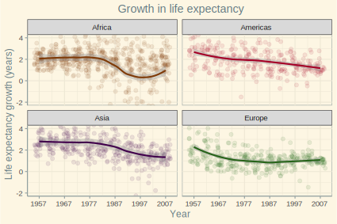

```{r setup, include=FALSE}
knitr::opts_chunk$set(echo = TRUE, message = FALSE, warning = FALSE, fig.align = 'center')
```

## Bring rectangular data in

- Load `Gapminder` and `tidyverse`:
```{r}
library(gapminder)
library(tidyverse)
```

- Some sanity check to make sure the `Gapminder` data was loaded properly:
```{r}
head(gapminder) %>%
  knitr::kable()
```

## Part 1: Factor management

We first check some general information about the `Gapminder` dataset before manipulating it.

```{r}
gapminder %>%
  str()
```

It is easy to see that the variables `country` and `continent` are both factors with 142 and 5 levels respectively.

### Data sorting using `arrange()` on numeric variables

We first explore the effects of the `arrange()` functions. In the following code, we attempt to sort the data by the mean life expectancy in 2007 for each continent:

```{r}
gap_meanLifeExp_1 <- gapminder %>%
  filter(year == 2007) %>%
  group_by(continent) %>%
  summarize(meanLifeExp = mean(lifeExp)) %>%
  arrange(meanLifeExp)  # Arrange the row according to meanLifeExp

knitr::kable(gap_meanLifeExp_1)
```


From the resulting table, it seems that the `arrange()` function does have an effect on the output data frame, as the order of the continents is now following the increasing order of the mean life expectancy.


However, if we use the resulting data frame for a figure, it is obvious that the arragement of the bars follows the alphabetical order of the names of the continents, rather than the order of the mean life expectancy:


```{r}
gap_meanLifeExp_1 %>%
  ggplot(aes(x = continent, y = meanLifeExp)) +
  geom_bar(stat = "identity")
```

### Data sorting using `arrange()` on factor variables

Instead of sorting the data using a numeric variable, we now attempt to sort the data using a categorical variable (i.e., a factor). To demonstrate, let us sort the data by continents in the reverse alphabetical order. This can be done by using `arrange()` in combination with `desc()`, as shown in the following code:

```{r}
gap_meanLifeExp_2 <- gapminder %>%
  filter(year == 2007) %>%
  group_by(continent) %>%
  summarize(meanLifeExp = mean(lifeExp)) %>%
  arrange(desc(continent))

knitr::kable(gap_meanLifeExp_2)
```

It appears that the data frame now is ordered as intented, but when we feed this data frame into a figure, the intented order is not reflected in the resulting figure:

```{r}
gap_meanLifeExp_2 %>%
  ggplot(aes(x = continent, y = meanLifeExp)) +
  geom_bar(stat = "identity")
```

### Factor and level dropping

From the `Gapminder`, we now drop the observations associated with Oceania in variable `continent`. Using the `str()` function, we can see that even after dropping these observations, the levels in the factor varialbes `continent` and `country` remain the same as in the original data set (5 and 142 levels respectively):

```{r}
gap_no_oceania <- gapminder %>%
  filter(continent != "Oceania")
  
str(gap_no_oceania)
```

However, the total number of rows in the data frame is now different (1680 vs. 1704).

Now we explore the effects of two similar functions: `droplevels()` and `fct_drop()`. With `droplevels()`, the function goes through each factor variables and eliminate the levels that do not appears in any observations. In this case, `continent` now only has 4 levels (i.e., Oceania is now gone), and `country` now has 140 levels (i.e., Australia and New Zealand are dropped).

```{r}
gap_no_oceania %>%
  droplevels() %>%
  str()
```

With `fct_drop()`, however, we can specify the variable whose levels we want to drop. In the following example, we drop the used level in `continent`. Notice that `continent` now has only 4 levels, but `country` still has 142 levels.

```{r}
gap_no_oceania %>%
  mutate(continent = fct_drop(continent)) %>%
  str()
```

### Reordering levels of factor variables

We have seen that, if we want to present data in a tabular format, we can using `arrange()` to do this. However, if we want the same order to appear in a plot, we need to use `fct_reorder()` or `fct_reorder2()`. To illustrate the functions, we make a plot that shows the growth in life expectancy from 1952 to 2007 in Asian countries, with the order of the countries based on the amount of growth.

First, we create a data frame that contains a variable `growth` showing the difference in life expectancy between 2007 and 1952. Furthermore, we arrange the order of `country` with reference to `growth` using `fct_reorder`.

```{r}
gap_growth <- gapminder %>%
  filter(year %in% c(1952, 2007), continent == "Asia") %>%
  select(country, year, lifeExp) %>%
  spread(key = year, value = lifeExp) %>%
  mutate(growth = `2007` - `1952`, country = fct_reorder(country, growth))

knitr::kable(gap_growth)
```

Notice that this time the data frame appears to be arranged differently than expected: it is still ordered by the variable `country` rather than by `growth`. However, when we use the same data frame to generate a plot, the bars are arranged as intended:

```{r}
gap_growth %>%
  ggplot(aes(y = growth, x = country)) +
  theme_bw() +
  geom_col() +
  geom_point(aes(y = `2007`, x = country, color = "Life exp. in 2007")) +  # We need to add points manually because of the data frame structure
  geom_point(aes(y = `1952`, x = country, color = "Life exp. in 1952")) +
  labs(title = "Growth in life expectancy in Asian countries", x = "Country", y = "Age (year)") +
  scale_color_manual(name = "", values = c("Life exp. in 2007" = "#00BFC4", "Life exp. in 1952" = "#F8766D")) +  # Manually add legend
  coord_flip() +
  theme(legend.position = "bottom")
```

From the plot, we can immediately see that Oman is the country that has the most significant growth in life expectancy, while Iraq saw the smallest growth among Asian countries.

## Part 2: File I/O

Here I experiment with the `write_tsc()` and `read_tsv()` functions with the `gap_growth` data frame created above. Particular attention is given to the variable `country`.

We first check the type of `country`, which is `factor`. We then save the data frame as a tsv file (`gap_growth.txt`). Upon importing the data frame from the tsv file again, let us investigate the type of `country`, to see if there is any change:

```{r, eval=FALSE}
class(gap_growth$country)  # "factor"

# Save the data frame
gap_growth %>%
  write_tsv(path = "./data/gap_growth.txt")

# Read in the data frame
gap_growth_fct_char <- read_tsv(file = "./data/gap_growth.txt", col_names = TRUE)

class(gap_growth_fct_char$country)  # "character"
```

We see that upon read-back, the type changed from `factor` to `character`.

Next, we change the values in `country` from alphabetical factor levels to non-alphabetical (i.e., numeric) factor levels. Similarly, we save this new data frame and read in it again to see if the type of the `country` variable has changed:

```{r, eval=FALSE}
# Change the levels from alphabetical to numeric
gap_growth_fct_num <- gap_growth %>%
  mutate(country = as.factor(as.numeric(country)))

class(gap_growth_fct_num$country)  # "factor"

# Save the data frame
gap_growth_fct_num %>%
  write_tsv(path = "./data/gap_growth_num.txt")

# Read in the data frame
gap_growth_num <- read_tsv("./data/gap_growth_num.txt", col_names = TRUE)

class(gap_growth_num$country)  # "integer"
```

Once again, the type has changed from `factor` to `integer`. We will need to use `as.factor()` to switch the type back to `factor`.

## Part 3: Visualization design

### Pretty plots up

For this part, I remade one of the plots from Homework 04 that shows the life expectancy growth in different continents. The vanilla plot output by `ggplot2` with defaults values is as follows. Also, local regression LOESS (locally estimated scatterplot smoothing) is used for plotting the lines.

```{r}
gapminder %>%
  group_by(country) %>%
  mutate(growth_lifeExp = lifeExp - lag(lifeExp)) %>%  # Calculate the growth compared to the previous year
  filter(year != 1952, continent != "Oceania") %>%  # Remove NA values and data from Oceania
  ggplot(aes(x = year, y = growth_lifeExp, color = continent)) +
  facet_wrap(~continent) + 
  geom_jitter() +
  geom_smooth(method = "loess")  # Fit regression lines
```

Then a few tweaks were added to the plot:

1. The theme `Solarized` from `ggthemes` was used instead (`Solarized` is a sixteen color palette designed for use with terminal and gui applications).
2. Changed `alpha` in `geom_jitter` to a lower value, so that the points would not appear clustering all together.
3. Changed the ticks of the `x` axis to match the years in the `Gapminder` dataset.
4. Changed the limits of the `y` axis to make the declining trend more visible. This of course implies that some data points are not shown in the plot.
5. Relabeled the titles of the axises and added a plot title.
6. Changed the colors associated with continents to the ones packaged along with `Gapminder`.
7. Removed the legend as the same information has been conveyed by the facet titles.
8. Centered the plot title.

```{r}
#install.packages("ggthemes")
library(ggthemes)

gapminder %>%
  group_by(country) %>%
  mutate(growth_lifeExp = lifeExp - lag(lifeExp)) %>%  # Calculate the growth compared to the previous year
  filter(year != 1952, continent != "Oceania") %>%  # Remove NA values and data from Oceania
  ggplot(aes(x = year, y = growth_lifeExp, color = continent)) +
  facet_wrap(~continent) +
  geom_jitter(alpha = 0.1) +
  geom_smooth(method = "loess") +  # Fit regression lines
  scale_x_continuous(breaks = seq(1957, 2007, 10)) +
  coord_cartesian(ylim=c(-2, 4)) +
  labs(x = 'Year', y = 'Life expectancy growth (years)', title = 'Growth in life expectancy') +
  theme_solarized() +
  scale_color_manual(values = continent_colors) +
  theme(
    plot.title = element_text(hjust = 0.5),
    legend.position = "none"
    )
```

### Plot with `plotly`

(Unfortunately, GitHub-flavored Markdown doesn't support `plotly` graphs, so you'll have to open the html file to enjoy its features...)

We can convert the plot above to a `plotly` graph. With a `plotly` graph, the user can interact with the graph by hovering over a point to see its values, zooming in and out, and panning around, among others.

```{r}
library(plotly)

p <- gapminder %>%
  group_by(country) %>%
  mutate(growth_lifeExp = lifeExp - lag(lifeExp)) %>%  # Calculate the growth compared to the previous year
  filter(year != 1952, continent != "Oceania") %>%  # Remove NA values and data from Oceania
  ggplot(aes(x = year, y = growth_lifeExp, color = continent)) +
  facet_wrap(~continent) +
  geom_jitter(alpha = 0.1) +
  geom_smooth(method = "loess") +  # Fit regression lines
  scale_x_continuous(breaks = seq(1957, 2007, 10)) +
  coord_cartesian(ylim=c(-2, 4)) +
  labs(x = 'Year', y = 'Life expectancy growth (years)', title = 'Growth in life expectancy') +
  theme_solarized() +
  scale_color_manual(values = continent_colors) +
  theme(plot.title = element_text(hjust = 0.5),
        legend.position = "none")

#ggplotly(p)
```

## Part 4: Writing figures to file

The plot generated by `ggplot2` can be saved using `ggsave()` with desired arguments. Notice that if we do not supply the `plot =` argument, the function will save the last plot generated by `ggplot2`. Also, the size of text will not scale with specified height and width, so it might take some experiments to find the best combination of these parameters. Mutilple image formats are supported by `ggsave()`, including `.svg`, which is a vector format, and `.png`, which is a raster format. The following code shows how to save the image with these two formats respectively:

```{r}
library(svglite)  # So we can save .svg images

# units specified the unit used in height and width
ggsave(filename = "./plots/growth.svg", plot = p, units = "cm", height = 10, width = 15)

q <- p + theme_economist()  # Change the theme of the plot
ggsave(filename = "./plots/growth.png", units = "cm", height = 10, width = 15)
```

The saved images can be imbedded into Markdown with the following syntax:

```


```


